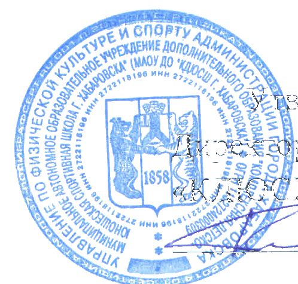
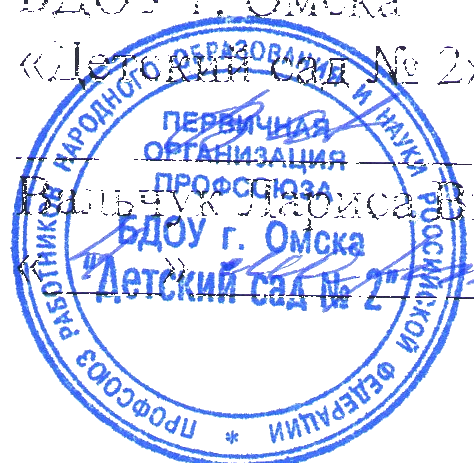
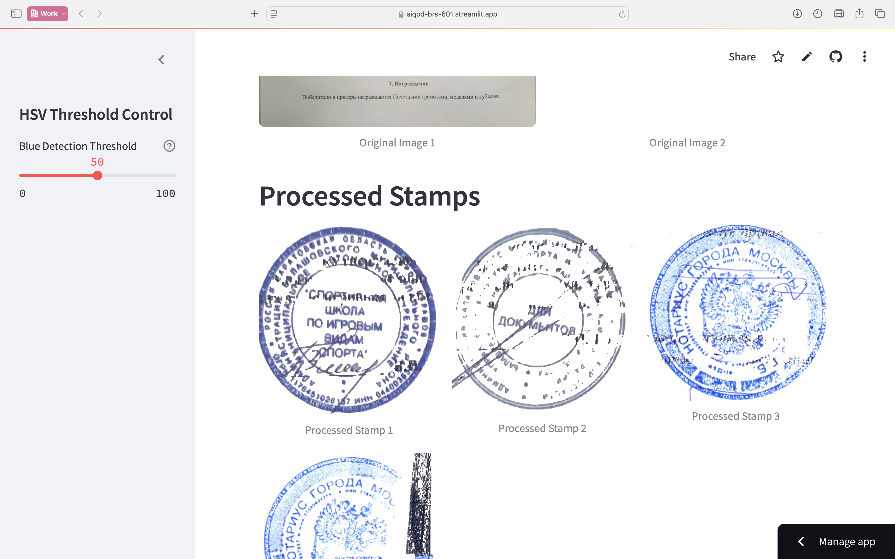

# Stamp Detection and Processing

This project implements a stamp detection and processing pipeline using YOLOv8 and OpenCV. It can detect stamps in documents and create background-less stamp images.

<p align="center">
   
   
</p>

## Website Application

This website is a Stamp Processor application built with Streamlit that automatically detects stamps in uploaded images using a YOLO (You Only Look Once) deep learning model. It processes the detected stamps by making the blue parts transparent through HSV color thresholding, allowing users to extract stamps with transparent backgrounds. The application features a user-friendly interface with a customizable threshold slider for fine-tuning the blue detection sensitivity, supports various input options (single image, multiple images, or zip files), and provides download capabilities for the processed stamps.

<p align="center">
   <a href="https://aiqod-brs-601.streamlit.app">
      
   </a>
</p>

## Workflow

1. **Dataset Preparation**
   - Manual annotation of stamps in documents using Roboflow
   - Dataset extraction and preprocessing
  
   

2. **Model Training**
   - YOLOv8n model training for stamp detection
   - Training performed in `signdetect.ipynb`

   ```python
   from ultralytics import YOLO

   model = YOLO("yolov8n.pt")

   model.train(
      data="/kaggle/input/stamp-data/My First Project/data.yaml",  
      epochs=100,       
      patience=5,       
      imgsz=640,
      device="cuda"
   )
   ```

3. **Inference Pipeline**
   - Document stamp detection using trained model
   - Bounding box extraction of detected stamps
   - Background removal using HSV color filtering for blue stamps


## HSV Color Ranges

The project uses specific HSV color ranges to isolate blue stamps:
- Hue: Blue color range
- Saturation: Color intensity
  
```python
lower_blue = np.array([90, 50, 50])
upper_blue = np.array([130, 255, 255])
hsv = cv2.cvtColor(cropped_img, cv2.COLOR_BGR2HSV)
mask = cv2.inRange(hsv, lower_blue, upper_blue)
```

## Model Details

- Base Model: YOLOv8n
- Task: Object Detection
- Classes: 1 (Stamp)
- Training Data: Custom annotated dataset

## Results

The pipeline successfully:
1. Detects stamps in documents
2. Extracts stamp regions
3. Creates clean, background-less stamp images

## **Contributors**

[](https://github.com/Adithya-Ajai) [](https://github.com/AravindXD)  [](https://github.com/Srimadhav-Seebu-Kumar)    [](https://github.com/JeevanYoganand) 